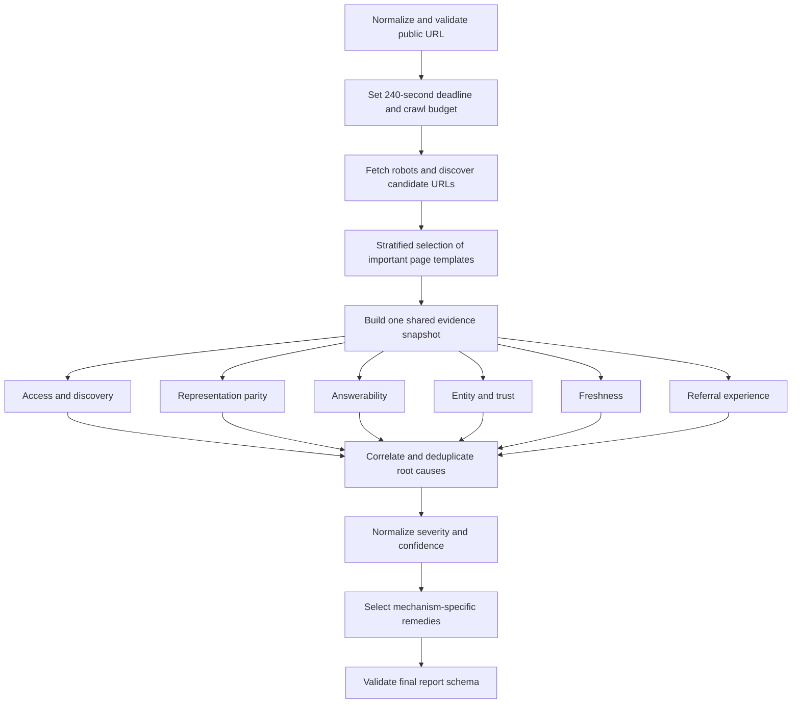

# Recommended Approach — Adobe University Hackathon 2026 Round 3

## Executive recommendation

Build an **evidence-driven website retrieval-readiness marketplace**, not a generic SEO checklist with AI terminology.

The marketplace should answer this chain of questions:

```text
Can an AI system discover the right URL?
→ Can it fetch the page?
→ Can it recover the same important facts a human sees?
→ Can it isolate a complete, correctly qualified answer?
→ Can it identify the correct entity and current version of the fact?
→ Is there enough trustworthy corroboration to use or cite it?
→ If a person lands on the cited page, can they verify the answer and continue their task?
```

The strongest implementation is a hybrid:

1. **Lean `SKILL.md` instructions encode the reasoning and decision rules.**
2. **Small deterministic scripts perform measurements that should not be delegated to an LLM.**
3. **The model performs only semantic judgments that code cannot reliably make.**
4. **A shared site snapshot prevents every skill from crawling the site again.**
5. **Severity and confidence are separate. Unknown or unavailable evidence is never treated as failure.**
6. **Empirical retrieval probes belong in the field-research/evaluation harness; keep them out of the required marketplace runtime unless the core is complete and the judge's search-tool/runtime contract is guaranteed.**

This combines the best ideas in the existing drafts while removing their most important unsupported assumptions and false-positive risks.

---

## 1. What the problem statement is actually testing

The submission is not primarily a one-off website report. The judges inspect the marketplace itself:

- whether the skills encode the right failure mechanisms;
- whether findings require evidence;
- whether the fixes resolve the observed mechanism;
- whether skill boundaries represent real separation of concerns;
- whether the process is deterministic, portable, safe, and under five minutes;
- whether the approach works on websites that were not used while developing it.

The problem statement also gives an implicit minimum coverage list in its sample skill description:

- crawlability;
- JavaScript-render gaps;
- missing or invalid structured data;
- important facts locked in non-text representations;
- stale or uncorroborated facts;
- entity ambiguity;
- weak on-site orientation or context continuity;
- discoverability and citation problems off site;
- engagement problems after the visitor arrives.

The biggest scoring risk is therefore not a missing exotic check. It is **confidently reporting problems that the evidence does not establish**.

---

## 2. Synthesis of the existing drafts

### `chatgpt.txt`

Keep:

- the retrieval-surface model;
- URL × representation as the unit of analysis;
- raw/rendered/extracted semantic parity;
- question generation based on site type;
- the shared snapshot architecture;
- separation of deterministic facts from semantic judgment;
- adaptive execution and empirical retrieval probes;
- avoiding a fake universal AI-readiness score.

Change:

- reduce the first release to a feasible P0/P1 scope;
- make external search and browser-agent task completion optional capabilities;
- avoid allowing provider registries to become brittle architecture claims.

### `gemini.txt`

Keep:

- hub-and-spoke composition;
- schema validation and deterministic aggregation;
- progressive disclosure;
- scripts for repeatable measurements;
- explicit runtime and packaging discipline.

Change:

- do not hard-code 40% render ratios, 60-word BLUF rules, or mandatory `@graph`/Wikidata links;
- do not estimate Core Web Vitals from HTML and present them as measured values;
- do not claim that a spoofed User-Agent proves the genuine provider crawler is blocked;
- do not claim that IndexNow directly guarantees ChatGPT discovery;
- do not make prompt-injection scanning a dedicated core skill.

### `gemini_researchreport.txt`

Keep:

- the distinction between index crawlers and user-triggered fetchers;
- machine-readable representation and token-efficiency concerns;
- the value of structured evidence, dates, and clear claims;
- the focus on both search systems and agent/browser use.

Change:

- many product-to-search-backend mappings are undocumented or configurable and must not be encoded as fact;
- the sample benchmark domain and measurements are illustrative, not empirical evidence;
- hidden prompt injection has not been shown to cause universal “silent de-indexing”;
- citation and bounce percentages must be attributed and must not become universal thresholds.

### `glm.txt`

Keep:

- the insight that judges must be able to read the reasoning in `SKILL.md`;
- removal of a standalone security skill;
- explicit fallback behavior when browser rendering is unavailable;
- report composition and error-handling guidance.

Change:

- instructions-only is too weak for deterministic counting, parsing, timeouts, and schema validation;
- missing `robots.txt`, missing sitemap, missing `Organization` schema, multiple H1s, or no personalization are not automatically high-severity defects;
- no browser means a render gap is unconfirmed, not established;
- the engagement audit must test intent continuity, not infer bounce from a few HTML attributes.

### `glm_flash.txt`

Keep:

- treating false-positive suppression as a first-class feature;
- differential evidence and confidence fields;
- distinct evidence sources for each skill;
- a bounded page sampler and global deadline;
- fixture tests and clean controls;
- mechanism-grounded remediation playbooks.

Change:

- Appendix F on email summarization does not justify a core email-audit skill when the required input is a website;
- security scanning can be a small integrity check, but it should not consume a specialist skill slot;
- the proposed severity table still overstates several weak heuristics.

### `grok.txt`

Keep:

- the tighter one-entrypoint-plus-six-specialist submission scope;
- keeping live multi-engine retrieval experiments in the research/evaluation harness rather than the required audit path;
- concrete site-finding tactics such as source-vs-rendered screening, exact-phrase searches for JS-only shells, and known-good false-positive controls;
- the emphasis on six-page sampling, partial reports, and a small submission rather than building a general crawler product.

Do not adopt:

- “no `Organization` schema on a brochure site = high” without an observed identity or extraction problem;
- uniform sitemap `lastmod` values as an automatic medium finding without contradictory evidence;
- missing dates on evergreen pricing, documentation, or about pages as a defect;
- no H1 as a high-severity discoverability failure by itself;
- severity as impact multiplied by confidence—keep them as separate report dimensions;
- claims that most AI crawlers never execute JavaScript. Measure representation loss instead.

### Final synthesis

The best final design is neither “all Python” nor “all prose.” It is:

```text
SKILL.md = procedure, gates, interpretation, fallback behavior, remedies
scripts/  = fetch, parse, compare, count, validate, deadline enforcement
model     = site classification, question generation, semantic completeness,
            contradiction interpretation, and recommendation contextualization
```

---

## 3. Important corrections from independent research

These corrections should directly influence the skill instructions.

### 3.1 Crawler roles must be separated

OpenAI documents separate roles for `OAI-SearchBot` and `GPTBot`; allowing search while blocking training is a supported policy. Anthropic similarly distinguishes `ClaudeBot`, `Claude-SearchBot`, and `Claude-User`. Perplexity distinguishes `PerplexityBot` and `Perplexity-User`.

Therefore:

- blocking a **training** crawler is a policy choice, not proof of search invisibility;
- blocking a **search/index** crawler is relevant to discoverability;
- a **user-triggered fetcher** may have different robots behavior from an index crawler;
- findings must state which role is affected.

### 3.2 `Google-Extended` is not a normal HTTP crawler to probe

Google describes it as a standalone robots product token controlling downstream Gemini/Vertex use of content Google has crawled. It is not equivalent to `Googlebot`, and should not be placed in a multi-User-Agent HTTP probe as if it were a fetching bot.

### 3.3 A spoofed User-Agent is only diagnostic evidence

Anyone can send `User-Agent: OAI-SearchBot`. Real crawlers may also be verified or treated differently using published IP ranges. Therefore:

- browser-UA `200` versus spoofed-bot-UA `403` proves an observed UA-dependent response from the auditor's IP;
- it does **not** conclusively prove the genuine verified bot is blocked;
- report it as suspected edge discrimination unless verified using owner logs or provider IP validation;
- a spoofed-bot `200` also does not prove genuine provider access.

### 3.4 Missing `robots.txt` is not a high-severity failure

A `404` for `robots.txt` normally means no crawl restrictions. An unavailable `robots.txt` caused by server errors is a different condition and can delay crawling. The audit must distinguish these outcomes.

### 3.5 Missing sitemap is contextual, not automatically high severity

Google explicitly says a small, well-linked site may not need a sitemap. A sitemap matters more for large, new, media-heavy, frequently updated, or poorly linked sites. The audit should first measure discoverability and site complexity.

### 3.6 JavaScript itself is not the defect

Google renders JavaScript, but not every crawler or direct fetcher does. The defect is loss of important information across representations—not the use of React, Vue, Angular, or an SPA architecture.

### 3.7 Structured data is a signal, not a universal requirement

Structured data can clarify page meaning and entities, but:

- it must match visible content;
- missing a particular type does not automatically make a page invisible;
- `@graph` is not mandatory;
- `sameAs` is useful for unambiguous identity, but requiring Wikipedia or Wikidata would systematically penalize small or new businesses;
- invalid or contradictory structured data is generally more serious than optional markup being absent.

### 3.8 `llms.txt` remains an opportunity, not a core ranking rule

`llms.txt` has meaningful adoption in developer/documentation ecosystems and a v2 proposal, but publication alone does not prove consumption, ranking, or citations. Evaluate it as a low-priority, site-type-dependent opportunity—especially for documentation-heavy sites—not as a defect for every website.

### 3.9 IndexNow recommendations must be precise

IndexNow is officially supported by a set of participating search engines including Bing. It can notify them of changed URLs; receipt does not guarantee indexing or citation. Recommend it for frequently changing content where supported, but do not claim it guarantees inclusion in ChatGPT or every AI assistant.

### 3.10 Core Web Vitals must be measured, not guessed

Missing image dimensions and blocking scripts are risk indicators. They are not an observed CLS, LCP, or INP value. Use, in order of preference:

1. first-party real-user monitoring, if the owner supplies it;
2. CrUX field data, when available;
3. a real Lighthouse/browser lab run;
4. static HTML risk indicators clearly labeled as diagnostic hypotheses.

### 3.11 Fixed BLUF and chunk-size laws are too brittle

The GEO paper reports that optimization strategies can improve visibility in its benchmark, but effects vary by domain. A universal “30–60 words” or “256–512 token chunks” rule is not justified for all engines.

Measure **answer isolation** instead:

- subject is named;
- claim is explicit;
- units and timeframe are present where relevant;
- qualifications and exceptions remain close to the claim;
- the passage remains accurate when extracted from surrounding text.

### 3.12 AI visibility must be measured repeatedly

AI answers vary with engine, prompt wording, account context, locale, and time. One query is a case study, not a stable visibility score. Field research and retrieval probes should use repeated measurements and record the conditions of every run.

---

## 4. Product model

Model the website as a set of **important questions, URLs, and retrieval surfaces**.

```text
(question, URL, surface) → observable state
```

Example:

```text
Question: “Does Acme support SAML?”
URL:      /security/sso

browser-visible text       → answer complete
raw server HTML            → answer absent
rendered DOM               → answer complete
reader extraction          → answer complete
structured data            → not applicable
search result/snippet      → stale wording
landing-page experience    → qualification hidden behind accordion
```

This explains an actual mechanism. A domain-level label such as “AI score 72” does not.

### Core audit dimensions

1. **Access and discovery** — Can the right public URL be found and fetched?
2. **Representation parity** — Do important facts survive raw, rendered, text, reader, and accessibility representations?
3. **Answerability** — Can likely questions be answered by complete, extractable passages?
4. **Entity and trust** — Is the entity unambiguous and are material claims supported or contradicted?
5. **Freshness and version integrity** — Can a system identify the current fact, product, policy, or documentation version?
6. **Referral experience** — Does the cited page let a visitor verify the answer and continue the task?

Empirical retrieval remains important, but use it to discover and validate these mechanisms during field research. It should not be a required seventh runtime dimension unless the environment guarantees a search tool and the core audit still stays below five minutes.

---

## 5. Recommended marketplace architecture

Use one entrypoint plus six genuinely distinct specialists.

```text
brand-retrieval-readiness/
├── marketplace.json
├── README.md
└── skills/
    ├── audit-orchestrator/                 # entrypoint
    │   ├── SKILL.md
    │   ├── scripts/
    │   │   ├── collect_snapshot.py
    │   │   ├── aggregate_findings.py
    │   │   └── validate_report.py
    │   └── references/
    │       ├── output_schema.json
    │       ├── snapshot_schema.json
    │       ├── severity_model.md
    │       └── remediation_playbook.json
    ├── access-discovery-audit/
    │   ├── SKILL.md
    │   ├── scripts/analyze_access.py
    │   └── references/provider_registry.json
    ├── representation-parity-audit/
    │   ├── SKILL.md
    │   └── scripts/analyze_representations.py
    ├── answerability-audit/
    │   ├── SKILL.md
    │   └── references/question_archetypes.md
    ├── entity-trust-audit/
    │   ├── SKILL.md
    │   └── scripts/analyze_entities.py
    ├── freshness-corroboration-audit/
    │   ├── SKILL.md
    │   └── scripts/analyze_freshness.py
    └── referral-experience-audit/
        ├── SKILL.md
        └── scripts/analyze_experience.py
```

### Why these boundaries are not padding

| Skill | Primary evidence | Judgment/fix family |
|---|---|---|
| `access-discovery-audit` | HTTP, robots groups, headers, redirects, links, sitemaps | CDN/WAF, crawl policy, index controls, canonical/discovery structure |
| `representation-parity-audit` | Raw HTML, rendered DOM, extracted text, accessibility tree, non-text elements | SSR/prerendering, semantic HTML, text alternatives, representation parity |
| `answerability-audit` | Likely questions, headings, passages, tables, FAQ/definitions | Information architecture and editorial restructuring |
| `entity-trust-audit` | JSON-LD, metadata, visible identity, external source agreement | Entity disambiguation, structured data correction, source-of-truth alignment |
| `freshness-corroboration-audit` | Page dates, sitemap dates, versions, redirects, old/current claims | CMS timestamps, versioning, deprecation, stale-source remediation |
| `referral-experience-audit` | Browser task path, overlays, landmarks, mobile behavior, measured performance | UX, accessibility, performance, navigation and task continuity |

### What should not be a dedicated skill

- **Prompt injection/security:** include a narrow hidden-instruction integrity check under representation parity, but do not claim ranking penalties or spend a core skill on it.
- **Email summarization:** outside the core website input. It can become a later optional marketplace extension.
- **Personalization detection via cookies/localStorage:** absence is not a defect. Test context continuity and task relevance instead.
- **`llms.txt` checker:** one low-cost check within access/discovery, not a standalone skill.
- **Live multi-engine retrieval probe:** run it in field research, evals, and an optional demo—not as a required marketplace specialist. Only promote it later if tool availability, repeatability, and runtime are controlled.

---

## 6. Entrypoint execution flow



### Step 1: URL and safety preflight

- accept only `http` or `https`;
- reject credentials in URLs;
- reject loopback, link-local, and private-network destinations to reduce SSRF risk;
- cap redirects, body bytes, content types, and per-request timeouts;
- never authenticate, submit forms, bypass CAPTCHA, or alter the site;
- follow robots rules for the auditor's own page sampling;
- retry only safe GET/HEAD requests and keep request concurrency low.

### Step 2: Page discovery and sampling

Do not audit only the homepage and do not randomly select sitemap URLs.

Select at most 6–8 representative public pages:

1. homepage/entity overview;
2. primary product or service page;
3. price, plan, hours, availability, or other decision page when present;
4. documentation/help/FAQ or policy page;
5. recent article/update/release page when present;
6. older or versioned page when relevant;
7. contact/location/about page for local or ambiguous entities;
8. one alternate locale or template if the site is multilingual.

Cluster candidate URLs by path pattern, metadata, and detected page type so 100 near-identical product URLs do not consume the audit budget.

If there is no sitemap, use crawlable same-origin `<a href>` links. Missing sitemap alone is not a defect.

### Step 3: Create the shared snapshot

For every selected URL, capture:

- requested and final URL;
- status, redirect chain, response headers, content type, bytes, and timing;
- raw HTML;
- raw visible-text extraction;
- title, descriptions, canonical, language, hreflang, robots meta, and `X-Robots-Tag`;
- headings and landmarks;
- links and anchor text;
- JSON-LD/microdata/RDFa observations;
- tables, lists, images, video, iframe, canvas, SVG, accordions, dialogs, and forms;
- rendered DOM and rendered visible text when a browser is available;
- accessibility tree or equivalent when available;
- measured performance results when available;
- which capabilities were unavailable.

Each specialist reads this snapshot. It should not independently crawl the whole site again.

### Step 4: Generate important questions

Classify the site conservatively, allowing multiple types, such as:

- SaaS/software;
- ecommerce/product;
- local business;
- publisher/news;
- documentation/developer platform;
- public service/government/education;
- person/organization/portfolio.

Generate 5–8 questions with different intents:

- identity: “What is this and who is it for?”
- capability: “Does it support/provide X?”
- transaction: “What does it cost and what are the constraints?”
- procedure: “How do I do X?”
- temporal: “What is the current version/status/policy?”
- comparison: “How does it differ from alternatives?”
- trust: “What evidence supports this claim?”
- local: “Where, when, and how can I visit/contact/book?”

Map every question to the best expected URL and answer passage. Do not require every site to answer every archetype.

### Step 5: Run specialist analysis

Scripts emit observations, not prose conclusions. For example:

```json
{
  "check_id": "REP-KEY-FACT-LOSS",
  "url": "https://example.com/pricing",
  "observations": {
    "raw_answer_present": false,
    "rendered_answer_present": true,
    "raw_words": 180,
    "rendered_words": 1140,
    "answer_key": "starting price"
  },
  "evidence_quality": "direct-render-comparison"
}
```

The skill's instructions decide whether the observation satisfies the finding gate.

### Step 6: Correlate root causes

Avoid reporting six symptoms of one root problem. For example:

```text
empty app shell
+ raw pricing absent
+ raw links absent
+ direct text extractor returns navigation only
= one root finding: key public content depends on client rendering
```

Related downstream effects can be listed as affected surfaces instead of separate findings.

### Step 7: Stop safely under the deadline

- use a 240-second internal deadline, leaving report time before the five-minute limit;
- per-request timeout around 8–10 seconds;
- concurrency no higher than 3;
- one retry for transient safe failures;
- stop optional browser, performance, and external-corroboration checks first;
- emit a valid partial report with explicit coverage and `not_evaluated` checks rather than overrunning.

---

## 7. Detection logic and false-positive gates

### 7.1 Access and discovery

Check:

- repeated status failures and redirect loops;
- robots policy by crawler role and path;
- `noindex`, `nosnippet`, `max-snippet`, `data-nosnippet`, and `X-Robots-Tag`;
- bot challenge/interstitial behavior;
- canonical conflicts and redirect/canonical disagreement;
- crawlable internal links;
- orphan-like important sitemap URLs not reachable from sampled navigation;
- sitemap validity and freshness hygiene when a sitemap is relevant;
- locale discovery and hreflang consistency when multiple locales exist;
- optional `llms.txt`/Markdown alternate availability for documentation-heavy sites.

Do not flag:

- `robots.txt` returning `404`;
- training-crawler blocks as citation-critical;
- missing sitemap on a small, comprehensively linked site;
- spoofed-UA differentials as proven genuine crawler blocks;
- missing `llms.txt` as a universal defect.

Escalate only when:

- the affected path contains an important public page;
- the policy or response actually prevents access/index eligibility for a relevant search role;
- the evidence is direct or supported by more than one observation.

### 7.2 Representation parity

Check important facts rather than total word-count ratios alone:

- key answer present in browser but absent in raw HTML;
- answer lost in reader/Markdown/text extraction;
- links or route destinations only available through script handlers;
- pricing/specification/comparison grids that lose row-column relationships;
- critical text embedded only in images, canvas, video, or inaccessible SVG;
- accordion/modal content absent from DOM until interaction;
- rendered structured data or metadata that is missing from initial fetch;
- accessibility-name/role/state gaps for interactive controls;
- suspicious hidden instructions, with accessibility patterns allowlisted.

A framework marker or empty `#root` is only a clue. A confirmed high-severity finding requires direct loss of a material fact or function.

If rendering is unavailable, report the check as limited. At most emit a medium-confidence suspected risk when multiple independent shell indicators exist.

### 7.3 Answerability

For each important question, evaluate:

- whether an official answer page exists;
- whether the answer is explicit rather than implied;
- whether subject, claim, units, timeframe, scope, and exceptions remain together;
- whether the heading gives enough context when a passage is extracted;
- whether lists and tables preserve their labels;
- whether sources, methodology, author, or primary evidence are visible when the claim requires them;
- whether several pages contradict one another;
- whether boilerplate overwhelms or fragments the answer.

Avoid arbitrary universal rules for word count, paragraph count, number of H1s, or heading depth. Heading hierarchy is strongest as accessibility/orientation evidence, not as proof of citation ranking.

### 7.4 Entity and trust

Check:

- visible organization/product/person name consistency across pages;
- title, Open Graph, canonical, JSON-LD, logo, contact, and legal-name consistency;
- JSON-LD syntactic validity;
- page-type-appropriate structured data and required properties only where applicable;
- internal `@id` consistency and broken references;
- structured claims matching visible claims;
- meaningful `sameAs` references when they actually exist;
- ambiguous names lacking category, location, legal identity, or other distinguishing context;
- optional external-source comparison for a small set of material facts.

Do not require every small company to have Wikipedia, Wikidata, Crunchbase, or an `@graph`. Do not call brand-owned social profiles independent corroboration.

### 7.5 Freshness and corroboration

Check:

- future or impossible dates;
- visible date versus structured date conflicts;
- sitemap `lastmod` versus page `dateModified` conflicts;
- version selectors, canonical versions, deprecation notices, and stale internal links;
- old pricing/product/policy pages still indexable without supersession signals;
- current page linking users to obsolete docs;
- material external sources disagreeing with the official current fact;
- RSS/feed dates when present.

Do not flag:

- an evergreen page merely because it lacks a date;
- old publication dates on intentionally historical content;
- uniform sitemap dates without corroborating evidence that they are false;
- a year string without understanding its semantic context.

### 7.6 Referral experience

Test the experience as a continuation of the generated question:

- is the cited answer visible and exact on arrival?
- are qualifications near the claim?
- is the relevant section deep-linked or findable?
- is content blocked by login, consent, geolocation, or intrusive overlay?
- can keyboard/assistive technology identify the main content and controls?
- can a visitor navigate to the next likely action?
- are link labels descriptive?
- is the mobile viewport usable?
- do measured field/lab performance data show poor LCP, INP, or CLS?

Static resource patterns may produce a “performance risk” observation, not a fabricated measured metric.

### 7.7 Out-of-band empirical retrieval validation

Run this protocol in the field-research/evaluation harness, not in the required marketplace path:

1. select no more than six high-value questions per evaluation case;
2. run the exact recorded query on citation-showing surfaces;
3. record whether search occurred;
4. record whether the brand was mentioned;
5. record the cited/retrieved URL and source role;
6. verify whether the retrieved passage supports the answer;
7. note stale, wrong-entity, wrong-page, or third-party preference;
8. repeat or paraphrase important queries;
9. compare the outcome with the marketplace's mechanism findings;
10. do not infer a permanent ranking from one run.

This validates whether the encoded reasoning explains real outcomes without making the submitted marketplace depend on paid APIs, account state, proprietary engines, or an unpredictable search tool.

---

## 8. Severity, confidence, and evidence policy

Severity and confidence answer different questions:

- **Severity:** If true, how much does this affect important discovery, correctness, or task completion?
- **Confidence:** How strongly does the available evidence establish that it is true?

### Severity

- **critical** — broad, confirmed blocker across important public surfaces, or a condition that makes most intended content unavailable/ineligible;
- **high** — important pages/facts cannot reliably be retrieved, attributed, kept current, or used;
- **medium** — retrieval or task completion works but is materially degraded or limited to part of the site;
- **low** — bounded hygiene issue or evidence-backed optimization opportunity.

### Confidence

- **high** — repeated direct measurement or direct representation comparison;
- **medium** — one indirect measurement plus corroborating signals, or semantic judgment with quoted evidence;
- **low** — hypothesis requiring owner logs, another tool, or another environment.

### Reporting gate

- do not emit low-confidence hypotheses as normal findings;
- place them in `limitations` or `needs_verification`;
- require high confidence for `critical`;
- include exact URL/path, observation, and method in every finding;
- never convert a failed tool call into a site defect.

---

## 9. Report design

Keep all required problem-statement fields and add useful metadata.

```json
{
  "site": "example.com",
  "audited_at": "2026-09-03T12:00:00Z",
  "audit_status": "complete",
  "coverage": {
    "pages_discovered": 210,
    "pages_selected": 8,
    "raw_fetches_succeeded": 8,
    "rendered_pages": 6,
    "external_retrieval_probe": "completed",
    "time_seconds": 173
  },
  "summary": {
    "total_findings": 4,
    "critical": 0,
    "high": 2,
    "medium": 2,
    "low": 0
  },
  "findings": [
    {
      "id": "F-001",
      "check_id": "REP-KEY-FACT-LOSS",
      "category": "representation-parity",
      "title": "Pricing qualifications disappear from static extraction",
      "severity": "high",
      "confidence": "high",
      "affected_urls": ["https://example.com/pricing"],
      "evidence": "On /pricing, the browser-rendered DOM states that SSO is Enterprise-only, but the raw HTML and extracted text contain the plan name without that qualification. Compared raw and rendered representations at audit time.",
      "why_it_matters": "A static fetch can recover an incomplete plan claim and present SSO as available on every tier.",
      "suggested_action": {
        "summary": "Server-render the complete pricing and eligibility statement and keep each feature next to its plan qualification.",
        "priority": "high",
        "effort": "medium",
        "owner": "web-platform",
        "acceptance_test": "A no-JavaScript fetch and rendered fetch both return the same plan, price, and eligibility facts."
      }
    }
  ],
  "opportunities": [
    {
      "title": "Publish Markdown alternates for the documentation section",
      "rationale": "The documentation pages are extraction-heavy and currently produce much more boilerplate than main content.",
      "priority": "low"
    }
  ],
  "needs_verification": [],
  "limitations": []
}
```

### Output principles

- keep proactive opportunities outside `findings` so they are not misrepresented as defects;
- include coverage and unavailable capabilities;
- include an acceptance test for every recommendation;
- prioritize root-cause fixes before cosmetic improvements;
- do not create a universal 0–100 score unless it is empirically calibrated;
- optionally show a pipeline matrix with `pass`, `finding`, and `not_evaluated`.

---

## 10. How to find real sites for field research and testing

Use two different activities:

1. **Field research:** learn which observable patterns occur on cited, uncited, stale, and misrepresented brands.
2. **Product validation:** measure whether the marketplace detects known conditions accurately and consistently.

Do not use the same domains for both tuning and final validation.

### 10.1 Build a query bank first

Create 40–60 queries across at least six verticals:

- SaaS/software;
- ecommerce/products;
- local services/restaurants/healthcare;
- developer documentation;
- news/publishing;
- government/education/public information.

For each vertical include:

- category discovery: “best X for Y”;
- brand fact: “does Brand X support Y?”;
- price/hours/availability;
- comparison: “X vs Y for Z”;
- procedure: “how to do X with Y”;
- trust/reputation;
- current/latest/version-specific query;
- a local or multilingual variant where relevant.

Avoid a corpus made only of famous technology brands.

### 10.2 Find cited and uncited matched candidates

For every query:

1. run it on two or three citation-showing assistants/search experiences;
2. save the exact prompt, engine, date/time, account state, locale, and answer;
3. record all brands mentioned and all cited URLs;
4. classify each result:
   - official site cited;
   - third-party source cited instead;
   - brand mentioned without citation;
   - brand absent;
   - wrong entity;
   - stale or incorrect fact;
   - citation points to an unhelpful landing page;
5. select one cited and one uncited/same-vertical candidate with approximately similar intent and business type;
6. record authority/size proxies so differences are not incorrectly attributed only to HTML features.

Repeat important queries at least three times or across prompt paraphrases. AI visibility is a distribution, not a one-shot rank.

### 10.3 Sources for discovering candidate domains

Use a mixture of sources to avoid selection bias:

- **Actual assistant citations:** primary source for cited candidates.
- **Organic search results:** same-query official sites that were eligible but not cited.
- **Tranco:** reproducible popularity-stratified random domains.
- **Chrome UX Report / HTTP Archive:** sites with real traffic and measurable technology/performance characteristics.
- **Common Crawl URL index:** confirm whether domains/pages appear in a large independent crawl corpus.
- **Google Maps, OpenStreetMap, local directories, chamber-of-commerce lists:** small/local business sites.
- **Vercel, Netlify, Webflow, Wix, Shopify, and framework showcases:** candidates across rendering/CMS architectures; screen them rather than assuming behavior.
- **Government and university directories:** public-service, PDF-heavy, multilingual, and accessibility cases.
- **`llms.txt` directories:** positive candidates for agent-oriented representations, but never evidence of citation impact by themselves.
- **Exact-phrase searches:** queries such as `"enable JavaScript to continue"` can surface JS-shell candidates; verify them by comparing source HTML with the rendered page rather than assuming every result has a retrieval gap.
- **Source-versus-rendered screening:** a visually full page with a nearly empty source response is a candidate for representation testing; a `#__next`, `#root`, or framework marker containing complete server-rendered text is a negative control, not a defect.

### 10.4 Suggested corpus composition

Use a practical target of 36 live domains: 12 cited-versus-uncited matched pairs (24 discovery domains) plus 12 archetype/false-positive validation domains.

| Archetype | Count | Include |
|---|---:|---|
| Documentation/developer | 6 | large official docs, small open-source docs, Markdown/`llms.txt`, JS docs |
| SaaS/software | 6 | large and small brands, pricing/security/integration questions |
| Ecommerce/product | 6 | large retailer, small Shopify/WooCommerce store, dynamic availability/specs |
| Local business/service | 6 | restaurants, clinics, repair/home services, ambiguous names |
| Publisher/news/blog | 4 | ad-heavy and minimal editorial designs, dated content |
| Government/education/nonprofit | 4 | public facts, PDFs, accessibility, policy dates |
| Multilingual/multi-region | 4 | locale variants, region-specific pricing or availability |

Split before tuning:

- 24 discovery sites organized as 12 cited-versus-uncited matched pairs;
- 4 known-good/adversarial regression sites;
- 8 sealed holdout sites that the rule authors do not inspect until thresholds and instructions are frozen.

Hold out entire domains and, where possible, entire template families—not just individual pages from a tuned domain.

### 10.5 Useful seed sites, without pre-labeling them

These are starting candidates, not “good” or “bad” ground truth:

- `agentskills.io` — official skill documentation, `llms.txt`, Markdown pages;
- `fastht.ml` — an early `llms.txt`/Markdown example;
- `developer.mozilla.org` — large reference documentation;
- `docs.stripe.com` — commercial developer documentation;
- `angular.dev` — framework documentation and modern rendering;
- `www.gov.uk` — public-service information architecture;
- `schema.org` — structured vocabulary/reference pages;
- `wikipedia.org` — high-authority editorial/reference control;
- `ikea.com` — multi-region ecommerce and locale complexity;
- `shopify.com` plus independently selected Shopify storefronts — same ecosystem, very different implementations;
- `ndtv.com` and `economictimes.indiatimes.com` — publishers with documented historical Core Web Vitals work; use current measurements rather than assuming old conditions remain;
- small local sites selected from one city and category through Maps/OpenStreetMap;
- small SaaS and open-source project sites selected from launch directories and GitHub topics.

Do not tune only against the named seed sites. The hackathon explicitly tests unseen sites.

### 10.6 Field-research ledger

Maintain two linked tables.

**Query outcome table**

```text
query_id
vertical
intent
engine
run_number
timestamp
locale/account state
exact query
brand mentioned?
official URL cited?
third-party URL cited?
answer correct?
answer current?
landing page useful?
notes/evidence
```

**Website signal table**

```text
site_id
url/page type
citation outcome class
HTTP/index controls
crawler-role robots policy
raw/rendered key-fact parity
crawlable links
structured-data validity and consistency
answer completeness
entity ambiguity
freshness/version signals
external contradictions
measured performance source
referral-continuity result
auditor finding IDs
human ground truth
```

The goal is not to discover one magic correlation. It is to identify repeated mechanisms and counterexamples.

---

## 11. Testing strategy: live sites are not enough

Live sites change, have unknown ground truth, and can make a broken detector appear correct. Use four complementary test layers.

### Layer A: deterministic unit fixtures

Create small HTML/HTTP fixtures with one controlled condition each:

1. `robots.txt` search-bot disallow versus training-bot-only disallow;
2. missing `robots.txt` returning 404;
3. unavailable `robots.txt` returning 503;
4. global `noindex` and page-only `noindex`;
5. redirect loop and canonical conflict;
6. small well-linked site without a sitemap;
7. large orphaned site without complete discovery;
8. CSR-only key fact versus SSR React page;
9. raw/rendered fact with a missing qualifier;
10. image-only price with and without meaningful text alternative;
11. semantic table versus visually equivalent scrambled grid;
12. invalid JSON-LD;
13. valid JSON-LD contradicting visible content;
14. same entity name with and without disambiguating context;
15. truthful and false sitemap `lastmod` cases;
16. current docs linking to a deprecated version;
17. legitimate `sr-only`/skip-link content versus suspicious hidden instruction;
18. accessible and inaccessible accordions/dialogs;
19. measured poor-performance fixture versus static-risk-only fixture;
20. aggressive overlay blocking the answer.

Every fixture should declare expected findings and expected non-findings.

### Layer B: saved live snapshots

Save sanitized raw/rendered snapshots from real sites for regression tests. This makes tests reproducible after the live site changes. Respect licensing and avoid bundling unnecessary copyrighted content; retain only the evidence needed for the test.

### Layer C: live integration corpus

Run the bounded audit on the 28 non-holdout live sites. Human reviewers label every finding as:

- true positive;
- false positive;
- duplicate symptom;
- correct observation but wrong severity;
- correct problem but generic/wrong remedy;
- not verifiable.

### Layer D: sealed holdout

Freeze:

- check definitions;
- severity gates;
- remediation mappings;
- page budget;
- output schema.

Then run the eight holdout domains once. Report misses and false positives honestly and only revise through a new versioned evaluation iteration.

---

## 12. Evaluation metrics

Track the metrics the rubric implies.

### Detection

- finding precision;
- finding recall on controlled fixtures;
- false positives per clean site;
- root-cause deduplication rate;
- severity agreement with human review;
- percentage of findings with direct quoted/measured evidence.

Prioritize precision. It is better to say `not_evaluated` than invent a defect.

### Suggested actions

Human-review each action for:

- does it address the measured mechanism?
- is it specific to the affected page/type?
- does it avoid claiming guaranteed rankings/citations?
- does it name an owner and effort?
- does it include a measurable acceptance test?

### Output and engineering

- 100% valid final JSON;
- correct severity counts;
- exactly one manifest entrypoint;
- every skill passes `skills-ref validate` when the validator is available;
- clean partial-report behavior;
- typical runtime below five minutes;
- no writes/authentication/site changes;
- stable result shape across repeated executions.

### Skill-specific evals

The official Agent Skills guidance recommends eval-driven iteration and comparisons with a baseline. Add realistic prompt/expected-output cases under `evals/`, including:

- normal website audit request;
- vague “why isn't AI finding my company?” request;
- URL with redirects;
- inaccessible URL;
- request that would require authentication, which must be refused/skipped;
- non-audit prompt that should not activate the entrypoint.

Run entrypoint prompts with and without the marketplace, then inspect full execution traces—not just final reports.

---

## 13. Implementation decisions

### Scripts versus instructions

Use both.

Scripts should own:

- HTTP requests, retries, limits, and deadlines;
- robots parsing;
- XML/HTML/JSON parsing;
- status/header/date extraction;
- link graph and sampling;
- raw/rendered comparison inputs;
- JSON Schema validation;
- deterministic aggregation and ID assignment.

The model should own:

- classifying site/page intent;
- generating likely user questions;
- deciding whether a passage is semantically complete;
- deciding whether two claims truly contradict;
- explaining business impact without overclaiming;
- contextualizing a remediation from a fixed playbook.

### Dependencies

- make the static core work with Python's standard library or bundled lightweight code;
- do not bundle Chromium or model weights;
- use an existing browser tool/Chrome when available;
- declare browser and network compatibility requirements;
- never silently download large dependencies during a judged run;
- make browser/search checks capability-gated and report when skipped.

### Provider registry

Store only documented facts:

```json
{
  "provider": "openai",
  "agent": "OAI-SearchBot",
  "role": "search-index",
  "robots_token": "OAI-SearchBot",
  "source": "https://developers.openai.com/api/docs/bots",
  "last_verified": "2026-09-03"
}
```

Do not encode rumors about proprietary search backends. Refresh the registry before submission.

### Remediation playbook

Key actions by stable `check_id`, including:

- mechanism rationale;
- safe implementation options;
- site-type applicability;
- owner;
- effort;
- priority rules;
- acceptance test;
- claims the report must not make.

This keeps recommendations consistent while allowing site-specific wording.

---

## 14. Recommended build order

### Phase 0 — research and ground truth

- finalize query bank;
- collect cited/uncited/misrepresented cases;
- create the signal ledger;
- define 20 controlled fixtures;
- select and seal the holdout domains.

### Phase 1 — contract first

- marketplace skeleton and manifest;
- one entrypoint;
- snapshot schema;
- intermediate finding schema;
- final report schema;
- severity/confidence policy;
- runtime and safety policy.

### Phase 2 — shared collector and deterministic core

- URL safety and normalization;
- bounded discovery/sampling;
- HTTP/robots/index controls;
- raw HTML metadata, links, schema, and text extraction;
- aggregator and schema validator.

### Phase 3 — highest-value specialists

1. access/discovery;
2. representation parity;
3. answerability;
4. entity/structured-data consistency.

This P0 already addresses most direct discoverability failures.

### Phase 4 — depth and engagement

5. freshness/version/corroboration;
6. referral experience and measured performance;

Run empirical retrieval experiments as part of Phase 5 evaluation, not as a required marketplace skill.

### Phase 5 — calibration

- run fixtures first;
- run clean controls and eliminate false positives;
- run live corpus;
- inspect traces;
- freeze logic;
- run sealed holdout;
- benchmark runtime and partial execution.

### Phase 6 — submission polish

- keep every `SKILL.md` lean;
- move long check catalogs and source registries to `references/`;
- document composition explicitly in `README.md`;
- validate every skill and the manifest;
- verify exactly one entrypoint;
- zip the marketplace root and confirm size below 50 MB.

---

## 15. P0, P1, and differentiator scope

### P0 — must be excellent

- safe bounded site sampling;
- correct crawler-role and index-control analysis;
- raw/rendered key-fact parity;
- important-question/answer mapping;
- structured-data validity and visible-content consistency;
- evidence, severity, confidence, acceptance tests;
- valid aggregation and report output;
- fixture and false-positive tests.

### P1 — strong submission

- entity ambiguity and limited external corroboration;
- freshness/version/deprecation checks;
- referral continuity and real performance evidence;
- capability degradation matrix;
- remediation playbook.

### Differentiator in the evaluation and README

Use the out-of-band retrieval study to demonstrate that the marketplace can explain observations such as:

> “For the question ‘Does Acme support SAML?’, a citation-showing search experience retrieved an old third-party comparison rather than Acme's current security page. The marketplace independently found that the official answer is absent from raw extraction and that an obsolete page remains internally linked.”

That is stronger than “add JSON-LD” because it connects an observed outcome to a measurable mechanism and a verifiable fix—without making the judged runtime depend on a proprietary search surface. If the core marketplace is complete and the execution environment is explicitly guaranteed, this protocol can later be packaged as an optional skill; it should not be the initial submission priority.

---

## 16. Claims the final marketplace should never make

Do not say:

- “Missing `llms.txt` makes this site invisible.”
- “A sitemap is required for every site.”
- “Blocking GPTBot removes the site from ChatGPT Search.”
- “Google-Extended returned 403.”
- “This spoofed User-Agent proves the real crawler is blocked.”
- “React/Angular/Vue content is invisible.”
- “Every section must answer within 60 words.”
- “RAG systems universally chunk at 256–512 tokens.”
- “No Wikidata entry means weak entity trust.”
- “`@graph` is mandatory.”
- “Missing width/height means measured CLS exceeds 0.1.”
- “Core Web Vitals cause a fixed bounce-rate change on this site.”
- “IndexNow guarantees ChatGPT citations.”
- “Hidden prompt text causes de-indexing.”
- “No personalization/localStorage is an engagement defect.”
- “One uncited prompt proves the brand is invisible.”

Prefer:

> measured behavior, exact scope, documented mechanism, stated confidence, and a reproducible acceptance test.

---

## 17. Primary references used for this recommendation

### Hackathon and skill format

- Problem statement: `hackathon.txt`
- Agent Skills specification: https://agentskills.io/specification
- Agent Skills best practices: https://agentskills.io/skill-creation/best-practices
- Agent Skills evaluation guidance: https://agentskills.io/skill-creation/evaluating-skills
- Agent Skills script guidance: https://agentskills.io/skill-creation/using-scripts

### Crawler and AI-search controls

- OpenAI crawler roles: https://developers.openai.com/api/docs/bots
- OpenAI publisher FAQ: https://help.openai.com/en/articles/12627856-publishers-and-developers-faq
- Anthropic crawler roles: https://support.claude.com/en/articles/8896518-does-anthropic-crawl-data-from-the-web-and-how-can-site-owners-block-the-crawler
- Perplexity crawler roles: https://docs.perplexity.ai/docs/resources/perplexity-crawlers
- Google common crawlers: https://developers.google.com/crawling/docs/crawlers-fetchers/google-common-crawlers
- Google AI features and websites: https://developers.google.com/search/docs/appearance/ai-features
- Bing Webmaster Guidelines: https://www.bing.com/webmasters/help/webmaster-guidelines-30fba23a

### Web discovery, rendering, semantics, and freshness

- Google JavaScript SEO basics: https://developers.google.com/search/docs/crawling-indexing/javascript/javascript-seo-basics
- Google sitemap guidance: https://developers.google.com/search/docs/crawling-indexing/sitemaps/overview
- Robots Exclusion Protocol: https://www.rfc-editor.org/rfc/rfc9309.html
- Google robots interpretation: https://developers.google.com/crawling/docs/robots-txt/robots-txt-spec
- Google structured-data guidelines: https://developers.google.com/search/docs/appearance/structured-data/sd-policies
- Schema.org `sameAs`: https://schema.org/sameAs
- Google crawlable-link guidance: https://developers.google.com/search/docs/crawling-indexing/links-crawlable
- W3C page structure/headings: https://www.w3.org/WAI/tutorials/page-structure/

### Performance and optional publishing mechanisms

- Web Vitals definitions and thresholds: https://web.dev/articles/vitals
- Core Web Vitals measurement workflow: https://web.dev/articles/vitals-tools
- CrUX API: https://developer.chrome.com/docs/crux/api
- IndexNow documentation: https://www.indexnow.org/documentation
- IndexNow supported engines: https://www.indexnow.org/
- `llms.txt` proposal: https://llmstxt.org/

### Research and corpus sources

- GEO paper (KDD 2024): https://doi.org/10.1145/3637528.3671900
- Tranco research-oriented site list: https://tranco-list.eu/
- HTTP Archive methodology: https://almanac.httparchive.org/en/2025/methodology
- Common Crawl URL index: https://commoncrawl.org/url-index

---

## Final positioning

Present the submission as:

> **A portable, evidence-first marketplace that audits where brand information is lost between discovery, retrieval, interpretation, trust, citation, and the visitor's landing-page task—and recommends the smallest mechanism-correct change that removes each failure.**

The submission should stand out through:

- semantic parity instead of raw word-count parity;
- question-to-page-to-answer mapping instead of homepage-only checks;
- correct crawler-role distinctions;
- root-cause correlation instead of checklist spam;
- explicit confidence and `not_evaluated` states;
- acceptance tests on every remedy;
- live field research plus reproducible fixtures and a sealed holdout corpus.
